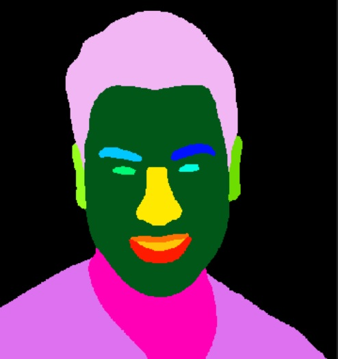
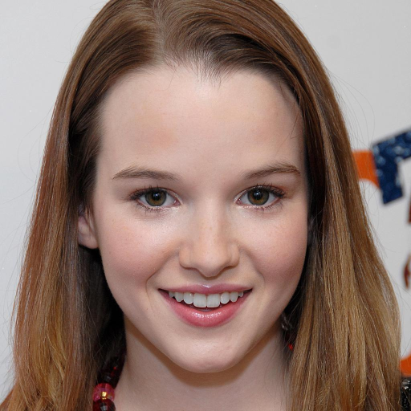
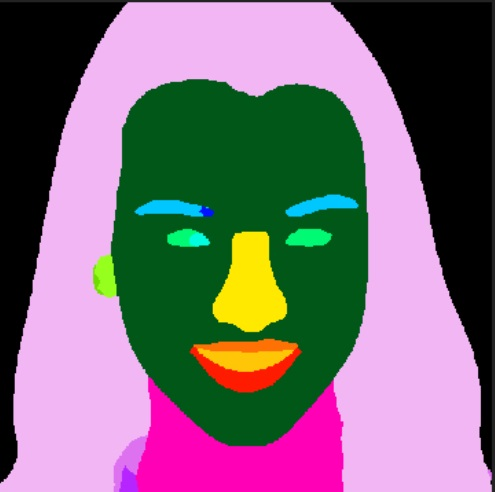
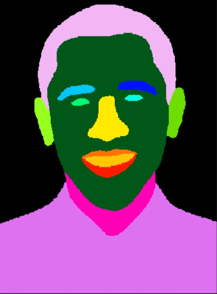

## Face Segmentation


<table>

<tr>
<th>Original</th>
<th>Segmentation</th>
</tr>

<tr>
<td></td>
<td></td>
</tr>

<tr>
<td></td>
<td></td>
</tr>

<tr>
<td></td>
<td></td>
</tr>

</table>


Model yang digunakan diambil dari sumber berikut:

- **Face detection:** 
  - S3FD model ported from [1adrianb/face-alignment](https://github.com/1adrianb/face-alignment).
  - MTCNN model ported from [davidsandberg/facenet](https://github.com/davidsandberg/facenet).
- **Face parsing:** 
  - BiSeNet model ported from [zllrunning/face-parsing.PyTorch](https://github.com/zllrunning/face-parsing.PyTorch).

##### *Each module follows the license of their source repo. Notice that some models were trained on dataset with non-commercial license.

## Usage

- install versi keras 2.2.4
- jalankan file demo.ipynb


### 1. Face detection
```python
models.detector.face_detector.FaceAlignmentDetector(fd_weights_path=..., lmd_weights_path=..., fd_type="s3fd")
```

**Arguments**
- `fd_weights_path`: A string. Path to weights file of the face detector model.
- `lmd_weights_path`: A string. Path to weights file of the landmarks detector model.
- `fd_type`: A string. Face detector backbone model of either `s3fd` or `mtcnn`.

**Example**
```python
from models.detector import face_detector

im = cv2.imread(PATH_TO_IMAGE)[..., ::-1]
fd = face_detector.FaceAlignmentDetector()
bboxes = fd.detect_face(im, with_landmarks=False)
```


### 2. Face Segmentation
```python
models.parser.face_parser.FaceParser(path_bisenet_weights=...)
```

**Arguments**
- `path_bisenet_weights`: A string. Path to weights file of the model.

**Example**
```python
from models.parser import face_parser

im = cv2.imread(PATH_TO_IMAGE)[..., ::-1]
fp = face_parser.FaceParser()
# fp.set_detector(fd) # fd = face_detector.FaceAlignmentDetector()
parsing_map = fp.parse_face(im, bounding_box=None, with_detection=False)
```

## Requirements
- Keras 2.2.4
- TensorFlow 1.12.0 or 1.13.1

## Acknowledgments
We learnt a lot from [1adrianb/face-alignment](https://github.com/1adrianb/face-alignment), [zllrunning/face-parsing.PyTorch](https://github.com/zllrunning/face-parsing.PyTorch), [swook/GazeML](https://github.com/swook/GazeML), [deepinsight/insightface](https://github.com/deepinsight/insightface)
